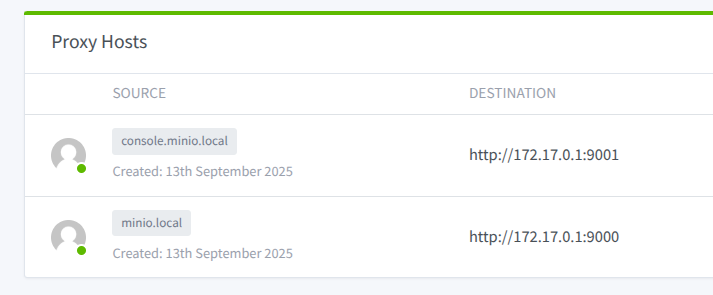
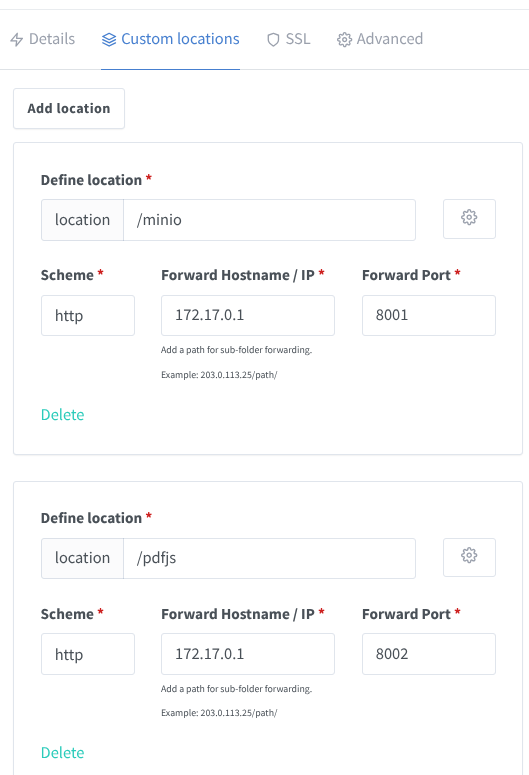
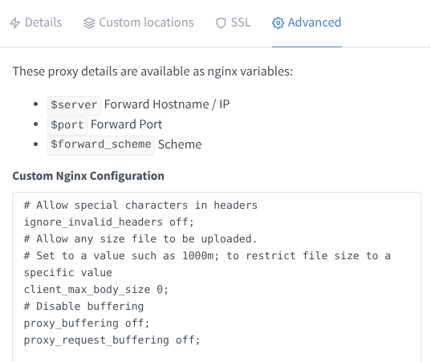

# MinIO File Uploader API

API này cung cấp một giao diện để tải lên và xóa các tệp từ một máy chủ MinIO. Nó được xây dựng bằng FastAPI và chạy trong một môi trường Docker.

## Mục lục

- [Yêu cầu](#yêu-cầu)
- [Cài đặt & Khởi chạy](#cài-đặt--khởi-chạy)
- [Tài liệu API](#tài-liệu-api)
  - [Xác thực](#xác-thực)
  - [Endpoints](#endpoints)
    - [Tải lên tệp](#1-tải-lên-tệp)
    - [Xóa tệp](#2-xóa-tệp)

## Yêu cầu

Để chạy dự án này, bạn cần cài đặt:

- [Docker](https://docs.docker.com/get-docker/)
- [Docker Compose](https://docs.docker.com/compose/install/)

## Cài đặt & Khởi chạy

1.  **Clone repository này:**

    ```bash
    git clone https://github.com/vanminh2018/MinIO.git
    cd MinIO
    ```

2.  **Tạo tệp môi trường:**

    Sao chép tệp `.env.example` thành một tệp mới có tên là `.env` và điền các giá trị cần thiết.

    ```bash
    cp .env.example .env
    ```

    Mở tệp `.env` và tùy chỉnh các biến:

    ```shell
    # MinIO Settings
    MINIO_ROOT_USER=your_minio_user
    MINIO_ROOT_PASSWORD=your_minio_password

    # URL để MinIO Console chuyển hướng sau khi đăng nhập (ví dụ: http://console.minio.local)
    MINIO_BROWSER_REDIRECT_URL=http://console.minio.local

    # URL công khai để truy cập các tệp đã tải lên (ví dụ: http://minio.local)
    MINIO_PUBLLIC_URL=http://minio.local

    # Endpoint API nội bộ cho giao tiếp giữa các service trong mạng Docker
    MINIO_API_ENDPOINT=http://minio1:9000

    # Token để xác thực API
    SECRET_TOKEN=your_secret_token
    ```

3.  **Khởi chạy các container:**

    Sử dụng Docker Compose để build và khởi chạy các dịch vụ.

    ```bash
    docker compose up --build -d
    ```

    - API sẽ chạy tại `http://localhost:8001`.
    - Giao diện MinIO Console sẽ có tại `http://localhost:9001`.

## Tài liệu API

### Xác thực

Tất cả các endpoint yêu cầu xác thực bằng `Bearer Token`. Bạn cần gửi token trong header `Authorization`.

- **Header**: `Authorization: Bearer <SECRET_TOKEN>`

Thay thế `<SECRET_TOKEN>` bằng giá trị bạn đã đặt trong tệp `.env`.

### Endpoints

#### 1. Tải lên tệp

- **Endpoint**: `POST /minio/upload`
- **Mô tả**: Tải một tệp lên một bucket cụ thể trên MinIO. Nếu bucket chưa tồn tại, nó sẽ được tạo tự động.
- **Content-Type**: `multipart/form-data`

**Tham số (Form Data):**

| Tên      | Kiểu   | Bắt buộc | Mô tả                                    |
| :------- | :----- | :------- | :--------------------------------------- |
| `bucket` | string | Có       | Tên của bucket để tải tệp lên.           |
| `folder` | string | Không    | (Tùy chọn) Thư mục con bên trong bucket. |
| `file`   | file   | Có       | Tệp cần tải lên.                         |

**Ví dụ sử dụng `curl`:**

```bash
curl -X POST "http://localhost:8001/minio/upload" \
     -H "Authorization: Bearer <SECRET_TOKEN>" \
     -F "bucket=my-test-bucket" \
     -F "folder=images/avatars" \
     -F "file=@/đường/dẫn/tới/tệp/của/bạn.jpg"
```

**Phản hồi thành công (200 OK):**

```json
{
  "bucket_name": "my-test-bucket",
  "file_name": "images/avatars/yourfile.jpg",
  "url": "http://minio.local/my-test-bucket/images/avatars/yourfile.jpg",
  "file_size": 123456,
  "content_type": "image/jpeg"
}
```

**Phản hồi lỗi:**

- `400 Bad Request`: Nếu tệp tải lên trống.
- `401 Unauthorized`: Nếu token không hợp lệ.
- `500 Internal Server Error`: Nếu có lỗi từ phía MinIO hoặc máy chủ.

---

#### 2. Xóa tệp

- **Endpoint**: `DELETE /minio/delete`
- **Mô tả**: Xóa một đối tượng (tệp) khỏi một bucket trên MinIO.

**Body (JSON):**

| Tên           | Kiểu   | Bắt buộc | Mô tả                                                      |
| :------------ | :----- | :------- | :--------------------------------------------------------- |
| `bucket_name` | string | Có       | Tên của bucket chứa tệp cần xóa.                           |
| `object_name` | string | Có       | Tên đầy đủ của tệp (bao gồm cả đường dẫn thư mục) cần xóa. |

**Ví dụ sử dụng `curl`:**

```bash
curl -X DELETE "http://localhost:8001/minio/delete" \
     -H "Authorization: Bearer <SECRET_TOKEN>" \
     -H "Content-Type: application/json" \
     -d '{
         "bucket_name": "my-test-bucket",
         "object_name": "images/avatars/yourfile.jpg"
     }'
```

**Phản hồi thành công (200 OK):**

```json
{
  "status": "success",
  "message": "File 'images/avatars/yourfile.jpg' was successfully deleted from bucket 'my-test-bucket'."
}
```

**Phản hồi lỗi:**

- `401 Unauthorized`: Nếu token không hợp lệ.
- `404 Not Found`: Nếu tệp không tồn tại trong bucket.
- `500 Internal Server Error`: Nếu có lỗi từ phía MinIO hoặc máy chủ.

## Xem tệp PDF

Dự án này bao gồm một trình xem PDF (PDF.js) có thể được sử dụng để hiển thị các tệp PDF được lưu trữ trong MinIO.

### URL để xem PDF

**Ví dụ:**

Nếu tệp PDF của bạn có thể truy cập tại `http://minio.local/fastapi-minio/myfile.pdf`, URL để xem sẽ là:

```
http://minio.local/pdfjs/web/viewer.html?file=http://minio.local/fastapi-minio/myfile.pdf
```

### Cấu hình Nginx Proxy



Trong `minio.local`:



Tùy chỉnh Advanced:



```nginx
# Allow special characters in headers
ignore_invalid_headers off;
# Allow any size file to be uploaded.
# Set to a value such as 1000m; to restrict file size to a specific value
client_max_body_size 0;
# Disable buffering
proxy_buffering off;
proxy_request_buffering off;
```
